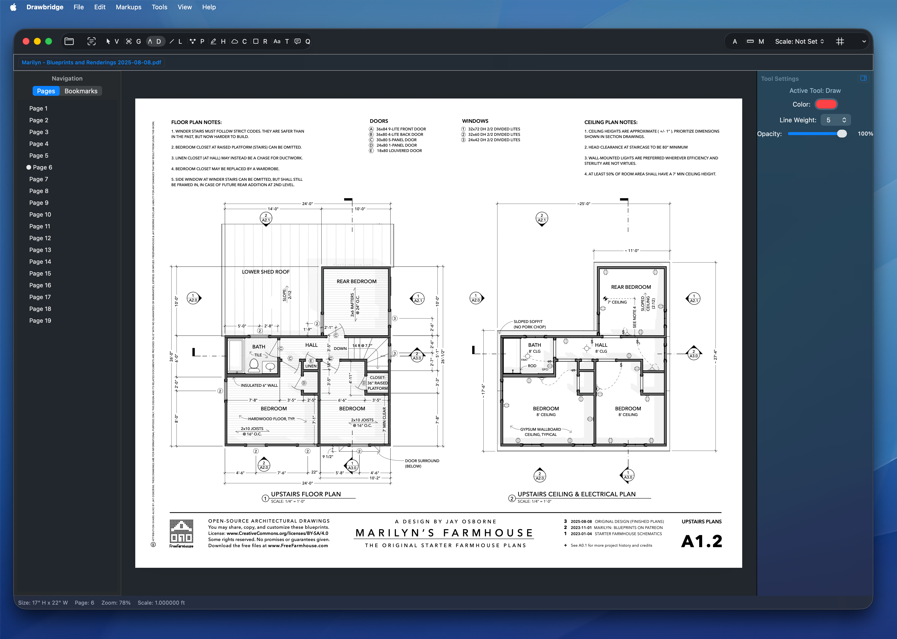

  

Drawbridge is a native macOS PDF markup and takeoff app built for architects, designers, and engineers, with cloud markups, text annotations, highlights, freehand drawing, callouts, measurements, and fast save/export workflows.

## Requirements

- Apple Silicon Mac (M1/M2/M3/M4)
- macOS 13.0 or newer

## Download

Get the latest release here:

https://github.com/dansc89/Drawbridge/releases/latest

Download the `.dmg`, open it, then drag **Drawbridge.app** into **Applications**.

## Quick Start

1. Open Drawbridge.
2. Open an existing PDF or create a new one.
3. Add markups.

## Support

If you hit an issue, open a GitHub issue with:
- what file you opened
- what action you took
- what happened vs expected behavior

## Developer Docs

Developer/build/release docs are in `DEVELOPMENT.md`.
