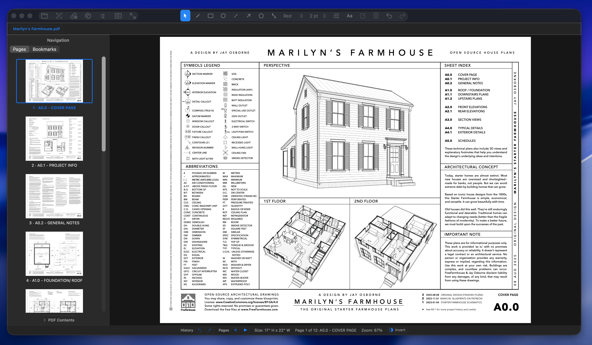

# Drawbridge

A native macOS PDF viewer and markup editor for architectural drawing sets. Navigate sheets, generate bookmarks and hyperlinks, and add editable vector markups while preserving the original drawing content.

  

## Download

**[Download the latest release](https://github.com/dansc89/Drawbridge/releases/latest)** — signed with Developer ID and notarized by Apple.

Download the **DMG**, open it, and drag **Drawbridge.app** into **Applications**. A ZIP containing the app is also available.

Requires **macOS 13 or newer** on an **Apple Silicon Mac (M1 or newer)**. Intel builds are not currently provided.

## What it does

- **Navigate drawing sets:** page thumbnails track the current sheet and refresh after markup changes. Switch to bookmarks, search sheet names, or use separate page and viewing-history controls.
- **Index and link sheets:** generate sheet numbers/titles and bookmarks from title blocks, then batch-link sheet references. Processing dialogs report stages and page progress, with cancellation and review before applying bookmarks.
- **Add vector markups:** pen, rectangle, ellipse, line, arrow, polygon, polyline, and on-page text boxes. The active tool is highlighted; custom colors, line weights, text sizes, and polygon fills are available in Markup Properties.
- **Review markups:** open the Markups List to see type, page, comment, and author. Click a row to jump to the annotation, search by text or author, and batch-delete selected markups with Undo. Links and form controls are excluded; locked annotations stay visible.
- **Manage pages and bookmarks:** Shift/Command-select several entries, then press Backspace/Delete or right-click to delete with confirmation. Undo/redo also works after saving while the document remains open. Deleting bookmarks leaves PDF pages intact.
- **Save PDF changes:** save the open file or a separate copy. Markup saves append annotation changes rather than rasterizing or rebuilding drawing pages.
- **Flatten and unflatten:** flatten supported consultant annotations into page content. Drawbridge embeds recovery information so its flattened PDFs can be unflattened after reopening.
- **Reduce file size:** lossless compression with content verification. Image resolution is preserved; already-compressed images may not get smaller.
- **Read and print:** document text search, text selection/copy, fit-page/fit-width views, and native macOS printing. Invert changes on-screen colors only, leaving saved and printed colors unchanged.

PDF Contents details are collapsed by default to leave more space for navigation.

## Quick start

1. Open a PDF with **Cmd+O**.
2. Navigate using **Pages** thumbnails or **Bookmarks**. Use **Go to Sheet (Cmd+L)** to find a sheet, or **Find (Cmd+F)** to search document text.
3. For an unindexed set, choose **Bookmarks > Auto-Generate Sheet Names/Bookmarks…** and review the results. Use **Hyperlinks > Batch Link Sheet Numbers…** to create sheet links.
4. Select a markup tool, draw on the PDF, and use **Cmd+S** to save. **Save As PDF… (Shift+Cmd+S)** creates a separate copy.

Choose **Drawbridge > Markup Author…** to set the name recorded on new markups. It defaults to your Mac account’s full name; imported markups retain their existing authors.

The [user manual](USER_MANUAL.md) covers navigation, page/bookmark deletion, saving, printing, flattening, and tool behavior.

## Markup shortcuts

| Tool | Shortcut |
| --- | --- |
| Select | V |
| Pen | P |
| Rectangle | R |
| Ellipse | E |
| Line | L |
| Arrow | A |
| Polygon | Shift+P |
| Polyline | Shift+N |
| Text box | T |
| Undo / Redo | Cmd+Z / Shift+Cmd+Z |

The Pen tool displays a pen cursor over the PDF, with the nib aligned to the drawing point.

Line and arrow tools use two clicks: start, then end. Text boxes let you type directly on the page. Escape cancels an unfinished drawing. Shortcuts do not activate drawing tools while you are typing text.

## Current limits

- Drawbridge can select, move, and delete standard unlocked markups from other PDF apps, with Undo/Redo. Imported text, style, and node editing are not yet supported. Flattened content and locked annotations cannot be selected as editable markups.
- Measurement/calibration, secure redaction, snapshot pasting, page combining/conversion, and general editing of original PDF text are not available.
- File reduction is lossless; there is no lossy image-quality or image-downsampling option.
- Encrypted or digitally signed PDFs are not supported for annotation-only markup saving. Flattening also excludes encrypted PDFs and PDFs with signature fields.
- Unflatten requires recovery information from Drawbridge. Unsupported/hidden annotations are retained, and flattening does not guarantee a smaller file.
- Switching documents requires saving or discarding pending edits and clears markup Undo history. Undo history is not retained after closing a document.

## Support and development

[Report an issue](https://github.com/dansc89/Drawbridge/issues) with your app version, macOS version, the action you took, and what happened. Include a sample PDF if you are able to share it.

For the source corresponding to a released build, open the tag listed on its [release page](https://github.com/dansc89/Drawbridge/releases/latest). That tag also contains its `DEVELOPMENT.md` build, signing, notarization, and test instructions.
