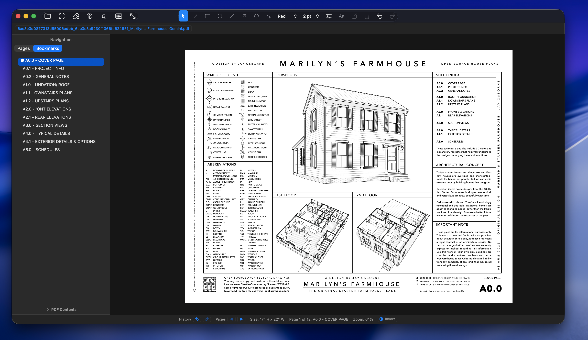

  

Drawbridge is a native macOS PDF viewer for architectural drawing sets, focused on generating sheet bookmarks and hyperlinks. Open, search, and navigate PDFs, then save bookmark and hyperlink changes. Markup, drawing, measurement, and page-conversion tools are not available.

## Requirements

- Apple Silicon Mac (M1 or newer)
- macOS 13.0 or newer

## Download

Get the latest release here:

https://github.com/dansc89/Drawbridge/releases/latest

Download the `.dmg`, open it, then drag **Drawbridge.app** into **Applications**.

## Quick Start

1. Open Drawbridge.
2. Open an existing PDF.
3. Use **Bookmarks > Auto-Generate Sheet Names/Bookmarks…** to name sheets and create bookmarks.
4. Use **Hyperlinks > Batch Link Sheet Numbers…** to link sheet references.
5. Save the PDF, or choose **File > Save As PDF...** to save a copy.
6. Use **File > Flatten PDF…** to make existing consultant markups permanent in the PDF you have open, while preserving drawing quality and interactive links. Click the same button again to Unflatten.
7. Use **File > Reduce File Size…** (or the down-arrow document toolbar button) for lossless compression. Drawbridge verifies decoded PDF content and saves over the open file only when the result is smaller. Image resolution, vector graphics, text, navigation, forms, and Unflatten recovery are preserved; JPEG images may already be compact.

Processing dialogs show the current stage and page counts. Cancel stops at the next safe page or processing-step boundary; Escape also cancels OCR. Canceling bookmark review leaves existing bookmarks intact. Duplicate OCR sheet numbers are reported and excluded from hyperlink destinations instead of guessing a target.

## Support

If you hit an issue, open a GitHub issue with:
- what file you opened
- what action you took
- what happened vs expected behavior

## Developer Docs

Developer/build/release docs are in `DEVELOPMENT.md`.
For trusted macOS distribution (Developer ID signing + Apple notarization), see the same doc.
User manual is in `USER_MANUAL.md`.
